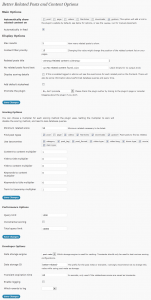

If you have ever implemented Custom Post Types or Custom Taxonomies for your Wordpress powered site, then you may have realised the lack of a proper related posts plugin which support custom types out of the box. Even the author of [Yet Another Related Posts Plugin](http://wordpress.org/extend/plugins/yet-another-related-posts-plugin/) is [not interested](http://wordpress.org/support/topic/plugin-yet-another-related-posts-plugin-custom-post-types-and-taxonomies/) to add support for it in the near future.

Well worry not because somone who was facing similar problems has coded a plugin and released for everyone under the name [Better Related Posts](http://wordpress.org/extend/plugins/better-related/). It supports both Custom Post types and Custom Taxonomies. And its just not a simple plugin to show related posts. It has options for performing fulltext search, caching of results through post meta or transients, custom scoring pattern to find the perfect match and even show the related posts in feeds.

Here is a screenshot of the options panel of the plugin:

\[caption id="attachment\_1164" align="alignnone" width="151" caption="Click to View the full Image"\]\[/caption\]

So Do try [Better Related posts](http://wordpress.org/extend/plugins/better-related/) plugin and share your thoughts about it.
