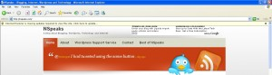

Yes, finally I have decided to Kill Internet Explorer 6 on my blog. If you are using IE 6 or a lower browser, you will now be asked to upgrade to a newer version of Internet Explorer. It's not that my site does breaks in IE 6 but because IE6 time is up. I am not asking you to upgrade to browsers other than IE but to a newer IE which is easy to upgrade to, works better and displays lots of sites and is easier to work for me as a webmaster.

Here is the screenshot of what will you see when you open site in IE6:

If you are using IE 6, probably you would have noticed many sites asking you to upgrade including YouTube, Orkut and Facebook. Recently the movement to kill IE 6 has speeded with the launch of [IE6nomore](http://www.ie6nomore.com) - an initiative by [Weebly](http://www.weebly.com/). It is providing with a code which will ask users to upgrade to Firefox, IE 8, Chrome or Safari( left Opera - too bad). There are many other sites who are pushing hard to kill IE 6 which include:

- [IE6nomore](http://www.ie6nomore.com) - is the latest initiative asking users to upgrade to IE6 though makes no mention of Opera as suggested upgrades.
- [IE Death March](http://iedeathmarch.org/) - is a blog which tells you a lot about shortcomings of IE 6 and advantages of upgrading.
- [Bring Down IE6](http://www.bringdownie6.com/) - is another site mentioning about evils of IE6.
- [Pushup](http://www.pushuptheweb.com/) - this one is not IE6 specific but is a site which asks users to upgrade their browsers.  Supports IE6, Firefox 2, Safari 2 and Opera 9.5.
- [Browser-Update](http://www.browser-update.org/) - is a site same as Pushup but instead of providing links to users to browser download sites, points towards its own customised page which something I don't like.
- [Browser Upgrade](http://www.browserupgrade.info/) - is another site which asks users to upgrade to Firefox 3 preferably and provides tools too. It also mentions about Opera, Safari and Google Chrome.
- [IE6 Update](http://ie6update.com/) - Is a specific IE6 site asking users to upgrade to IE8 only. They don't support options for other browsers since according to them a user on IE would like to upgrade to IE only. I use this tool on NSpeaks
- [IE6 Upgrade Warning](http://code.google.com/p/ie6-upgrade-warning/) - is a Google Code project providing with a script which asks users to upgrade from IE6. It supports all major browsers as options for upgrade.
- [Sevenup](http://code.google.com/p/sevenup/) - is the most unusual site which provides tool to upgrade both IE6 and IE7. Not only it provides upgrade options but lists the reasons to upgrade via a Light box effect window.

Above are some of the sites. I may have missed few too. So when are you planning to kill IE6 on your website?

And by the way if you have already killed IE6 on your website, do add your site's name at [I dropped IE6](http://idroppedie6.com/). And finally [Microsoft is not going to drop support for IE6](http://blogs.msdn.com/ie/archive/2009/08/10/engineering-pov-ie6.aspx) anytime soon.
