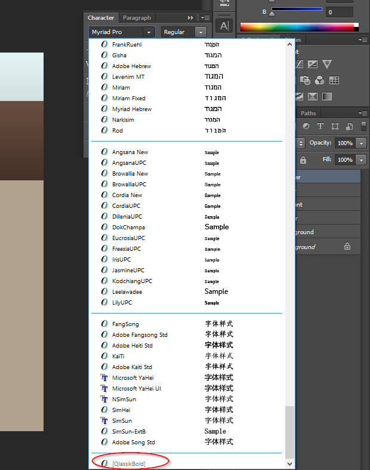

The common problem I face whenever I buy new designs is that sometimes I need to know all the fonts used to make the PSD file. Sometimes Photoshop popups an ugly message saying some fonts are missing and it has no inbuilt method to tell you which font was used. So how to tell which fonts are needed?

There is a crude method to put a type tool to every text in the PSD and check on which text it says missing font. That is a bit unprofessional method and does not work if you have a large amount of text in the design.

The second method is to use Javascript. Oh No, don't panic, this is not complex and you don't even need to know Javascript because it's a readymade script available.

[Download the Script](https://nspeaks.com/download/font.jsx.zip)

Now in Photoshop, go to File>>Scripts>>Browse and now locate the folder which contains the font.jsx file. And after selecting the script file, click Load.

Now it will ask for the location of the folder which contains the PSD for which you want to know the fonts of. After then click Ok and then wait for some time. Don't click anywhere in PS for the time being. After some time, you will notice a file named fonts.txt in the same folder which contained the PSD file. The text file will contain the list of all fonts used in the PSD file.

Script Courtsey: [Photoshop Scripting Community](http://www.ps-scripts.com "Photoshop Scripting Community")

### Easier Method for Photoshop CS4 and above

\[caption id="" align="alignnone" width="620"\] Missing Fonts in a PSD File\[/caption\]

Photoshop CS4 and later offer an easier method of finding the missing fonts. Open the PSD file, go to the Character panel, and click on the font dropdown. The missing font names will be listed at the bottom of the list in grayed-out fashion.
