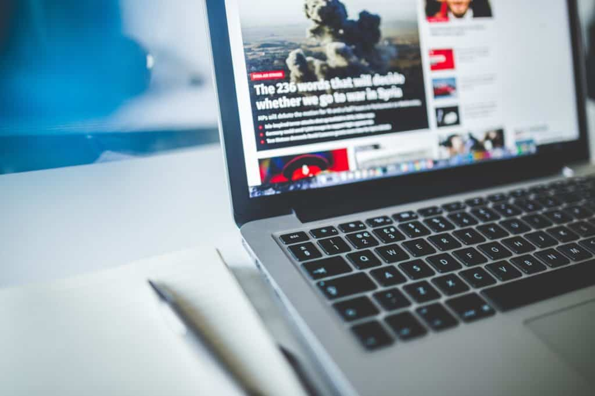

 Photo by Negative Space on [Pexels.com](https://www.pexels.com/photo/gray-laptop-computer-near-journals-177557/)

**[Update 19 Dec:](#bookmarklet) Added [Readium](https://sugoidesune.github.io/readium/) Bookmarklet.**

Medium started as an excellent platform for anyone who wanted to just write without any distraction. The Editor and the community were both very welcoming and soon it became a good place to go to whenever you needed to read something interesting or to jot down what's on your mind. But every platform has to sustain itself and Medium started bringing about some changes. Medium started inviting big publishers and pushed their content behind a paywall which was fine since it has to earn money and nobody likes ads these days. And then it allowed everyone to put their content behind a paywall. Then they started giving preference to paid articles over the free ones. I could still get behind that. And when you thought, this is it, they went ahead and replaced their entire homepage with paywall articles. Free articles became more difficult to find.

Moreover not all writers from all countries could monetize their content. Why? Because they pay writers using [Stripe](https://stripe.com/) which only works in 24 countries ([Their page](https://stripe.com/global) mentions 34 countries but 10 of those are where you need an invite which is incredibly hard to come by). And I am not sure why Medium did it, but it's like just to piss off new users, they shut down the option of using custom domains for your Medium publications. I guess pure and simple greed to keep all the traffic to itself.

Keeping in mind all this, I recently shifted my [Diary](https://diary.nspeaks.com) hosted on Medium to my server. Anyway, this post is not about that. I will post how I shifted my Blog in a later post. For now, if you are still using Medium to read articles, you know you can only read 3 articles in a month for free. Beyond that, you need to pay them membership fees. Well, you shouldn't have to. Let's see how you can Bypass Medium's Paywall/Subscription and read all the articles for free. There are several ways to do this. I will try to cover them all.

## Using a Browser Bookmarklet

This is probably the easiest way to get past Medium's Paywall. Visit [Readium](https://sugoidesune.github.io/readium/) and drag the toolbar to your browser's bookmark bar. That's it. The next time you reach a paid article, click on the Readium button on your bookmark bar and you will be able to read the article in full.

This extension also unlocks articles from the New York Times, Bloomberg, Business Insider, and Towards Data Science.

## Using a Browser Extension 

This browser extension not only unlocks the articles on the main medium website but also on the publications using Medium on their domains. If you are using Firefox Browser, you can get the extension from their [addon store](https://addons.mozilla.org/en-US/firefox/addon/medium-unlimited-read-for-free/). But if you are using Chrome or a Chromium-based Browser like Opera, Vivaldi, Microsoft Edge for Chromium, etc, then you [need to follow some steps](https://medium-unlimited.ml/download/) before you can use the extension as Google banned the extension from its store.

The extension is receiving regular updates and is probably the best way to get rid of their Paywall.

## Using Twitter

On 28 February 2019, [Medium CEO, Ev Williams announced that all Medium paid articles can be accessed for free](http://web.archive.org/web/20190811051122/https://twitter.com/ev/status/1100899021621583872), if accessed via Twitter. If someone posts a medium link on Twitter, it will open the article directly bypassing its Paywall. Authors were concerned that this would mean less money for them even though Ev tried to convince them otherwise. The above browser extension uses this as one of the methods.

How to go about this? Compose a DM to yourself and paste the link of the medium story you want to open. And then visit the link from your DM box. It should open directly without asking you to pay to access it. This method is a bit cumbersome as you will have to do it every time with every link.

## Using Incognito Mode

Whenever you reach a limit on Medium, just copy the link of the article you want to read and open it in a Private/Incognito window of your browser and it should open just fine. A little less cumbersome than the Twitter method but works just fine.

There are two more methods but I am not touching on them in detail here. One of them involves blocking cookies for the medium.com domain. The second method refers to using the [archive.is](http://archive.fo) and [web.archive.org](http://web.archive.org) sites to save the article and then reading them from it. Both methods work just fine.

For now, these methods work. But for how long, one can't say. And until Medium mends its ways and allows writers from all around the world to monetize their content and offer its readers a chance to read both free and paid articles properly, you should stop using Medium. If you have a blog hosted at Medium, it's time to shift them elsewhere, or if you can host them yourself, do it.
